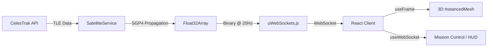

<p align="center">
  
</p>

<h3 align="center">Real-Time 3D Satellite Tracker & Space Intelligence Platform</h3>

<p align="center">
  
  
  
  
  
  
</p>

---

## ✨ Overview

**AstroView** is a hackathon-grade, real-time 3D satellite tracking and space intelligence platform. It visualizes **5,000+ live satellites** orbiting Earth using real TLE data from CelesTrak, streamed at **20Hz** over WebSockets.

Built to bridge the gap between complex space data and everyday users — whether you're tracking debris, monitoring climate patterns, or just exploring what's flying above your head right now.

---

## 🚀 Key Features

| Feature | Description |
| :--- | :--- |
| 🌍 **3D Earth Dashboard** | Interactive globe powered by React Three Fiber with real textures, clouds, and atmosphere glow |
| 📡 **Live Satellite Tracking** | 5,000+ Starlink satellites propagated from real TLE data via `satellite.js` |
| 🎯 **Click-to-Inspect** | Select any satellite to view live telemetry — speed, altitude, lat/lon |
| 🛰️ **Mission Control** | Overhead satellite count based on your geolocation + space weather status |
| 🔴 **Space Debris Layer** | Toggle a visualization of 3,000 simulated debris particles in LEO |
| 🌡️ **Climate Heatmap** | Switch to a climate mode showing global temperature anomaly overlays |
| 📊 **Analytics Panel** | Context-aware stats that adapt per active data layer |
| 🔔 **Smart Subscriptions** | Subscribe to alert topics (Weather, Debris, Launches) — persisted locally |
| 🎵 **Space Sonification** | Ambient audio synthesis via Tone.js mapped to orbital data |
| 🏅 **Gamification** | "Space Passport" badge system to reward exploration |
| 🧒 **ELI5 Mode** | Toggle simplified explanations of satellite data for non-experts |
| 📖 **Interactive Tutorial** | Guided onboarding tour for first-time users |

---

## 🏗️ Architecture

```
AstroView/
├── client/                  # React 19 + Vite + R3F
│   ├── src/
│   │   ├── components/
│   │   │   ├── 3d/          # Earth, SatelliteSwarm, Shaders
│   │   │   ├── audio/       # SpaceAudio (Tone.js)
│   │   │   ├── gamification/# Passport Badge System
│   │   │   ├── layout/      # ImmersiveLayout
│   │   │   └── ui/          # MissionControl, HUD, Alerts, Layers
│   │   ├── hooks/           # useWebSocket, useGeolocation
│   │   └── lib/             # gamification, subscriptions (Zustand)
│   └── package.json
│
├── server/                  # Fastify + uWebSockets.js
│   ├── src/
│   │   ├── index.ts         # REST API (port 3001)
│   │   ├── ws.ts            # WebSocket server (port 3002, 20Hz broadcast)
│   │   ├── db.ts            # MongoDB connection
│   │   └── services/
│   │       └── satelliteService.ts  # TLE fetch + SGP4 propagation
│   └── package.json
│
├── todo.md                  # Development roadmap
└── README.md                # You are here
```

### Data Flow



---

## 🛠️ Tech Stack

### Frontend
- **React 19** — UI framework
- **React Three Fiber** + **Drei** — 3D rendering
- **Three.js** — WebGL engine
- **Framer Motion** — Animations & transitions
- **Tailwind CSS** — Styling
- **Zustand** — State management (subscriptions)
- **Tone.js** — Audio synthesis
- **Lucide React** — Icons

### Backend
- **Fastify** — REST API server
- **uWebSockets.js** — High-performance WebSocket server (20Hz binary broadcast)
- **satellite.js** — SGP4/SDP4 orbital propagation
- **MongoDB** — Data persistence
- **Axios** — TLE data fetching from CelesTrak

---

## ⚡ Quick Start

### Prerequisites
- **Node.js** ≥ 18
- **MongoDB** running locally (default port 27017)

### 1. Clone & Install

```bash
git clone https://github.com/your-username/AstroView.git
cd AstroView
```

```bash
# Install server dependencies
cd server
npm install

# Install client dependencies
cd ../client
npm install
```

### 2. Start the Server

```bash
cd server
npm run dev
```

> 🟢 REST API on `http://localhost:3001`
> 🟢 WebSocket on `ws://localhost:3002`

### 3. Start the Client

```bash
cd client
npm run dev
```

> 🟢 Frontend on `http://localhost:5173`

---

## 🎮 Usage Guide

| Action | How |
| :--- | :--- |
| **Rotate Earth** | Click & drag |
| **Zoom** | Scroll wheel |
| **Select Satellite** | Click on any dot |
| **Switch Layers** | Use the Layer Control (left side) |
| **View Overhead Sats** | Open Mission Control (top-right) |
| **Toggle Audio** | Mute button (bottom-right) |
| **Subscribe to Alerts** | Mission Control → Alert Subscriptions |
| **Toggle ELI5 Mode** | Expert/ELI5 button (bottom-right) |
| **View Badges** | Passport icon (bottom-left) |

---

## 📦 Development Phases

- ✅ **Phase 1** — Foundations (Monorepo, TypeScript, Dependencies)
- ✅ **Phase 2** — Core "Wow" Features (3D Earth, Sonification, Alerts)
- ✅ **Phase 3** — Gamification & Polish (Passport, ELI5, Animations)
- ✅ **Phase 4** — Real Data & Interaction (TLE Engine, Interactive HUD)
- ✅ **Phase 5** — Onboarding & Mission Control (Tutorial, Geolocation)
- ✅ **Phase 6** — Real-World Impact (Debris, Climate, Analytics)
- ✅ **Phase 7** — User Features (Subscriptions, Visual Polish)

---

## 🤝 Contributing

1. Fork the repository
2. Create a feature branch (`git checkout -b feature/amazing-feature`)
3. Commit your changes (`git commit -m 'Add amazing feature'`)
4. Push to the branch (`git push origin feature/amazing-feature`)
5. Open a Pull Request

---

## 📝 License

This project is open source and available under the [MIT License](LICENSE).

---

<p align="center">
  Built with ❤️ and stardust ✨
</p>
